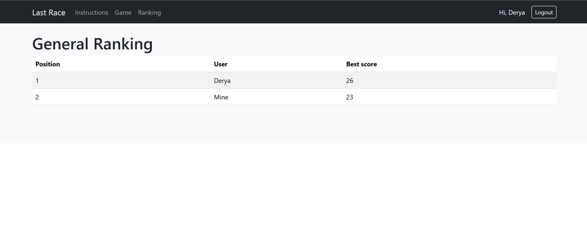
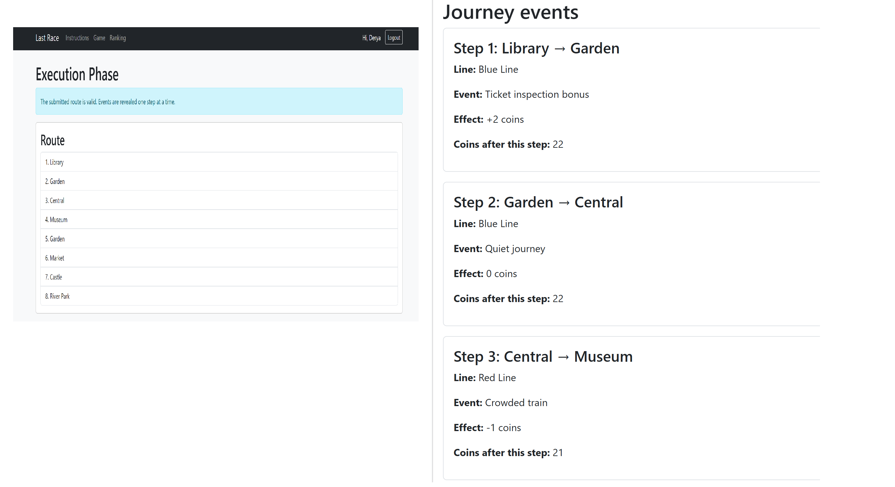

# Exam #1: "Last Race"

## Student: S354453 SEVINCOK DERYA

## React Client Application Routes

* Route `/`: instructions page. It explains the rules of the game. Anonymous users can only access this page.
* Route `/login`: login page. It allows registered users to authenticate with username and password.
* Route `/game`: setup phase. It shows the full underground network with stations, lines, connections, and interchange stations.
* Route `/game/planning`: planning phase. It shows the start station, destination station, timer, station list without visible connections, and selectable segments.
* Route `/game/result`: execution/result page. It shows whether the route was valid and, for valid routes, reveals the journey events step by step.
* Route `/ranking`: general ranking page. It shows the best score of each user who has played at least one game.

## API Server

### Authentication APIs

* `POST /api/sessions`
  Request body: `{ username, password }`
  Response body: authenticated user object `{ id, username, name }`.

* `GET /api/sessions/current`
  Request parameters: none.
  Response body: current authenticated user object. Returns `401` if the user is not authenticated.

* `DELETE /api/sessions/current`
  Request parameters: none.
  Response body: none. Logs out the current user.

### Game and Network APIs

* `GET /api/network`
  Request parameters: none.
  Response body: full underground network with stations, metro lines, and segments. Protected API.

* `POST /api/games/start`
  Request parameters: none.
  Response body: planning data with stations, segments, randomly assigned start station, randomly assigned destination station, and minimum distance. Protected API.

* `POST /api/games/submit`
  Request body: `{ segmentIds: [number] }`
  Response body: route validation result, execution steps, events, coin updates, final coins, and stored score. Protected API.

* `GET /api/ranking`
  Request parameters: none.
  Response body: list of users with their best score. Protected API.

* `GET /api/health`
  Request parameters: none.
  Response body: server health message.

## Database Tables

* Table `users` - contains registered users with username, display name, password hash, and salt.
* Table `games` - contains completed game results, final score, completion timestamp, and the related user.
* Table `stations` - contains the fixed set of underground stations.
* Table `metro_lines` - contains metro lines with their name and display color.
* Table `station_lines` - represents the many-to-many relationship between stations and metro lines. It is used to identify interchange stations.
* Table `segments` - contains connected pairs of stations belonging to a specific metro line.
* Table `events` - contains possible random journey events with their description and coin effect.

## Main React Components

* `App` in `App.jsx`: defines the main application routes and protected routes.
* `AuthProvider` in `AuthContext.jsx`: manages authentication state and exposes login/logout logic through React Context.
* `Navigation` in `Navigation.jsx`: shows the navigation bar and changes links according to the login state.
* `LoginForm` in `LoginForm.jsx`: controlled form used to authenticate registered users.
* `Instructions` in `Instructions.jsx`: shows the game instructions and the entry point to start a game.
* `GameSetup` in `GameSetup.jsx`: retrieves and displays the complete underground network before the game starts.
* `NetworkMap` in `NetworkMap.jsx`: reusable component that displays stations and, depending on the phase, optionally displays lines and connections.
* `PlanningPhase` in `PlanningPhase.jsx`: manages the 90-second planning phase, selected segments, route construction, and route submission.
* `ExecutionResult` in `ExecutionResult.jsx`: displays invalid route results or reveals valid journey events step by step.
* `Ranking` in `Ranking.jsx`: retrieves and displays the general ranking.

## Screenshots

### General ranking page

### During a game

## Users Credentials

* `derya@example.com`, password: `person1`
* `mine@example.com`, password: `person2`
* `emir@example.com`, password: `person3`

## Use of AI Tools

I used ChatGPT as a support tool to clarify some course-related concepts, review error messages during debugging, and improve the wording of parts of the README. All implementation choices were checked, adapted, and tested manually while developing the project.
